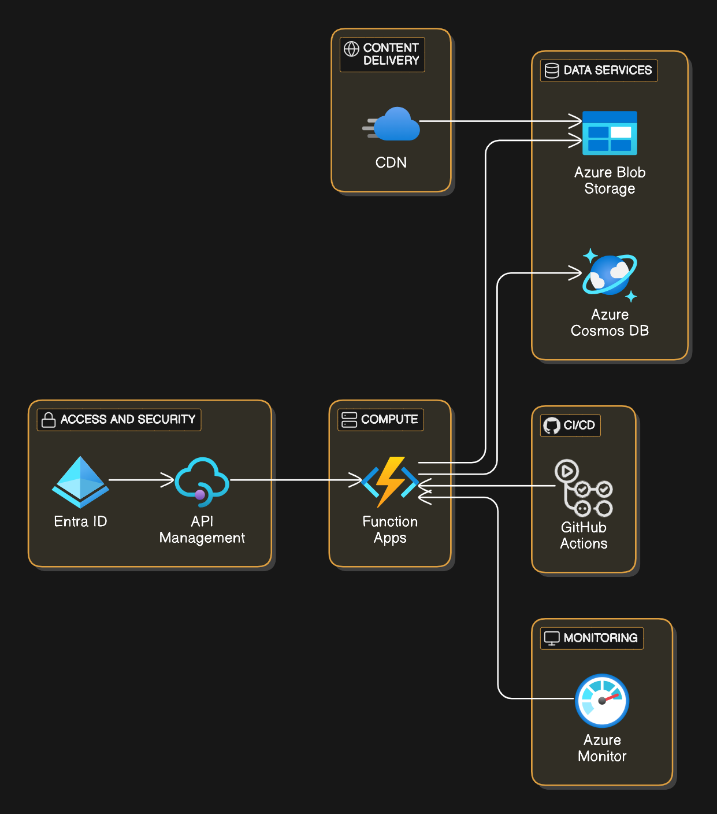
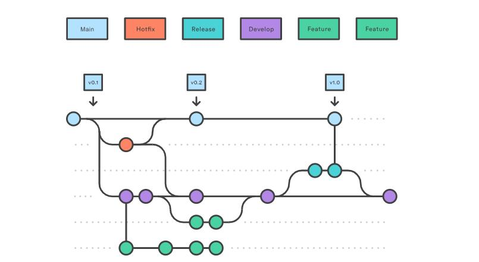

- [Introdução](#introdução)
- [Case - Arquiteto de Soluções](#case---arquiteto-de-soluções)
  - [Objetivo do Desafio](#objetivo-do-desafio)
  - [Descritivo da Solução](#descritivo-da-solução)
    - [Requisitos de negócio](#requisitos-de-negócio)
    - [Requisitos obrigatórios](#requisitos-obrigatórios)
    - [Requisitos diferenciais](#requisitos-diferenciais)
    - [Requisitos não funcionais](#requisitos-não-funcionais)
    - [Observações](#observações)
- [Solução proposta](#solução-proposta)
  - [Cloud provider comparação](#cloud-provider-comparação)
  - [Stack](#stack)
  - [Arquitetura](#arquitetura)
  - [Diagrama](#diagrama)
  - [FinOps](#finops)
  - [Segurança](#segurança)
  - [Monitoramento](#monitoramento)
    - [Azure](#azure)
  - [Estrutura desenvolvimento](#estrutura-desenvolvimento)
  - [Docker](#docker)

# Introdução

pt-br: O objetivo deste repositório exemplo é mostrar uma arquitetura serverless em ambiente Azure (sem vendor lock-in) por amostragem, trazendo detalhes técnicos de uma necessidade cada vez maior que é uso de alta tecnologia, alto desempenho e baixo custo.


# Case - Arquiteto de Soluções

• O Arquiteto de Soluções é responsável por compreender e transformar
requisitos de negócios, sejam funcionais ou não-funcionais, em
capacidades e/ou competências para realizar atividades que gerem
valor para a Organização;
• É de responsabilidade do Arquiteto de Soluções desenhar arquiteturas
de contexto com as distribuições e responsabilidades dos processos e
etapas que devem ser realizadas de forma isolada ou não, habilitando a
segregação das capacidades;
• É requerido do Arquiteto de Soluções uma capacidade analítica
necessária para a definição de conceitos e o desenho de processos e
soluções que componham a cadeia de valor de cada negócio da
organização;
• Da mesma forma, é de responsabilidade tornar essas soluções
escaláveis, reutilizáveis e flexíveis necessários para suportar a
estratégia de negócios e a arquitetura de referência;
• O Arquiteto de Soluções deve possuir grande capacidade de
comunicação e visão sistêmica, definindo estratégias de integração
entre áreas, atividades, serviços e/ou sistemas que juntos alcançam o
resultado esperado no planejamento estratégico da Organização;

---

## Objetivo do Desafio
Desenvolver uma arquitetura que integre processos e sistemas de forma
eficiente, garantindo a entrega de valor para a organização. Isso inclui a
definição de contextos, capacidades de negócio e domínios funcionais,
escalabilidade das soluções para garantir alta disponibilidade, segurança e
desempenho, a comunicação eficaz entre áreas e serviços, a seleção
adequada de padrões arquiteturais, integração de tecnologias e frameworks,
além de otimização de requisitos não-funcionais. Deve abranger a
capacidade analítica, a visão sistêmica e a habilidade de criar soluções
flexíveis e reutilizáveis.
• Compreensão dos Requisitos de Negócios: O Arquiteto de Soluções
deve entender profundamente os requisitos funcionais e não funcionais
da organização. Isso inclui compreender as capacidades necessárias
para gerar valor.
• Arquitetura Corporativa: O foco deve estar na criação de
arquiteturas que se alinhem com o contexto de cada negócio. Isso
envolve definir processos, etapas e responsabilidades de forma isolada
ou integrada.
• Escalabilidade: Garanta que a arquitetura possa lidar com o aumento
da carga de trabalho sem degradação significativa do desempenho.
Considere dimensionamento horizontal, balanceamento de carga e
estratégias de cache.• Resiliência: Projete para a recuperação de falhas. Isso inclui
redundância, failover, monitoramento proativo e estratégias de
recuperação.
• Segurança: Proteja os dados e sistemas contra ameaças. Implemente
autenticação, autorização, criptografia e mecanismos de proteção
contra ataques.
• Padrões Arquiteturais: Escolha padrões adequados, como
microsserviços, monolitos, SOA ou serverless. Considere trade-offs
entre simplicidade e flexibilidade.
• Integração: Defina como os componentes se comunicarão. Avalie
protocolos, formatos de mensagem e ferramentas de integração.
• Requisitos Não-Funcionais: Otimize para desempenho,
disponibilidade e confiabilidade. Defina métricas e metas claras.
• Documentação: Registre decisões arquiteturais, diagramas e fluxos de
dados. Isso facilita a comunicação e a manutenção.
Lembrando que não é necessário que todas essas premissas sejam
apresentadas na codificação, mas nas decisões e representações
arquiteturais do projeto. A intenção do desafio é analisar o seu
conhecimento empírico, capacidade de tomada de decisão, aplicação de
boas práticas, decomposição dos domínios e componentes, etc.
## Descritivo da Solução
Um comerciante precisa controlar o seu fluxo de caixa diário com os
lançamentos (débitos e créditos), também precisa de um relatório que
disponibilize o saldo diário consolidado.

---

### Requisitos de negócio
• Serviço que faça o controle de lançamentos
• Serviço do consolidado diário

---

### Requisitos obrigatórios
• Mapeamento de domínios funcionais e capacidades de negócio
• Refinamento do Levantamento de requisitos funcionais e não funcionais
• Desenho da solução completo (Arquitetura Alvo)
• Justificativa na decisão/escolha de ferramentas/tecnologias e de tipo de
arquitetura
• Pode ser feito na linguagem que você domina
• Testes
• Readme com instruções claras de como a aplicação funciona, e como
rodar localmente
• Hospedar em repositório publico (GitHub)
Caso os requisitos técnicos obrigatórios não sejam minimamente atendidos,
o teste será descartado.

---

### Requisitos diferenciais
• Desenho da solução da Arquitetura de Transição (se necessária,
considerando uma migração de legado)
• Estimativa de custos com infraestrutura e licenças
• Monitoramento e Observabilidade
• Critérios de segurança para consumo (integração) de serviços

---

### Requisitos não funcionais
O serviço de controle de lançamento não deve ficar indisponível se o sistema
de consolidado diário cair. Em dias de picos, o serviço de consolidado diário
recebe 50 requisições por segundo, com no máximo 5% de perda de
requisições.

---

### Observações
Leve em consideração todos os critérios técnicos mencionados, mas não se
prenda somente a eles. Use o teste para demonstrar sua habilidade em
tomar decisões sobre o que é importante durante a definição de soluções
para o problema de negócio.
Também são bem vindas descrições sobre o que você gostaria de ter
implementado ou evoluções futuras para o sistema proposto. Entendemos
que o tempo para a execução do projeto é limitado, então aproveite a
documentação do seu projeto para apresentar pontos que possam
demonstrar melhor suas capacidades, além do que é possível demonstrar
através do desenolvimento desse desafio.
Desejamos boa sorte para você!

---

# Solução proposta
- Apesar da solução proposta for para o cloud Provider Azure ela é cloud agnostic, pois é possível implementar em qualquer nuvem pública.
- O custo do ambiente foi levado em consideração, anexado o valor na calculadora dentro do repositório com um valor extremamente amigável
- Por questões de didática foram escolhidas stacks, mas totalmente possível serem utilizadas similares.

---

## Cloud provider comparação
A solução em si apesar de ser apresentado no Azure é cloud agnostic, sendo possível ser implementada em qualquer nuvem, podemos ter uma comparação dos serviços [neste site](https://cloudcomparisontool.com/) ou [neste site](https://cloud.google.com/docs/get-started/aws-azure-gcp-service-comparison), mas entre os recursos que serão usados basicamente temos:


| Cloud   | Azure   | AWS   | GCP   |
|---------|------------|------------|------------|
| **Recurso**    | Azure Storage account    | AWS Simple Storage Service (S3)    | Cloud Storage    |
| **Recurso**    | Azure Api Management    | Amazon Publisher Services, Mobile Ads    | Apigee    |
| **Recurso**    | Azure Function    | AWS Lambda    | Cloud Run Functions    |
| **Recurso**    | Azure Front Door   | Amazon CloudFront   | Cloud CDN   |
| **Recurso**    | Azure Cosmos DB  | Amazon DocumentDB, Amazon DynamoDB  | Firestore  |


---

## Stack
- IaC: Infrastructure as Code (infraestrutura como código), visando documentar e facilitar o provisionamento do ambiente foi utilizado o [Terraform](https://www.terraform.io/) por ser uma ferramenta mais difundida, de rápida curva de aprendizagem. Mas poderia ter sido usada qualquer outra como Pulumi, Cloudformation, Azure Bicep, GCP SDK, etc.
- DaC: Diagram as Code (diagrama como código)
- Azure Portal
- Makefile
- Bash Script
- Azure Function
- YAML
- NoSQL
- GitHub
- Python
- C#

---

## Arquitetura
- BaaS: Backend as a Service
- FaaS: Function as a Service, a utilização de uma Azure Function é bem interessante por ser dinâmica e escalável sob a necessidade de requests, além de um custo estremamente amigável, com um limite de até 1 milhão de requisições com o valor gratuito.
- Pay as you go: Pago sob demanda
-
---

## Diagrama

Com o objetivo de documentar a arquitetura utilizada, o conceito de Diagram as Code se faz presente e pode ser visto no snippet de código abaixo:



```
// Diagram elements
Access and Security [icon: lock] {
  Microsoft Entra ID [icon: azure-active-directory, label: "Entra ID"]
  API Management [icon: azure-api-management]
}

Data Services [icon: database] {
  Azure Blob Storage [icon: azure-blob-storage]
  Azure Cosmos DB [icon: azure-cosmos-db]
}

Compute [icon: server] {
  Function Apps [icon: azure-functions]
}

"CI/CD" [icon: github] {
  GitHub Actions [icon: github-actions]
}

Monitoring [icon: monitor] {
  Azure Monitor [icon: azure-monitor]
}

Content Delivery [icon: globe] {
  CDN [icon: azure-cdn]
}

// Connections
Microsoft Entra ID > API Management
API Management > Function Apps
Function Apps > Azure Blob Storage
Function Apps > Azure Cosmos DB
CDN > Azure Blob Storage
Function Apps < GitHub Actions
Function Apps < Azure Monitor

```

---

## FinOps
A escolha da solução foi tomada em pilares como manutenibilidade, performance e custo. 

- O valor mensal da solução proposta fica =  R$ 35,61/mês
- A Lei Geral de Proteção de Dados (LGPD) foi levada em consideração, então todos os recursos foram provisionados na região Brasil South.
- Calculadora em anexo no repositório nomeda como `ExportedEstimate.xlsx` para detalhes de custo de cada recurso, não foram mencionados recursos gratuitos.
- Por ser um ambiente pequeno e de baixa complexidade, não é necessário recursos de alta criticidade e custo.

---

## Segurança
Boas práticas de segurança tomadas aqui listadas:
- Zero Trust: Conceito de que nenhum desenvolvedor seria confiável, no sentido de somente fornecer acesso quando solicitado em conjunto com a política abaixo. [Detalhes sobre Zero Trust](https://www.cloudflare.com/pt-br/learning/security/glossary/what-is-zero-trust/)
- Principle Least Access: O acesso fornecido aos desenvolvedores deve ser somente o necessário para que seja realizadas suas demandas, diminuindo superfície de impacto. [Principio Least Access](https://www.paloaltonetworks.com/cyberpedia/what-is-the-principle-of-least-privilege#:~:text=The%20principle%20of%20least%20privilege%20(PoLP)%20is%20an%20information%20security,to%20complete%20a%20required%20task.)

---

## Monitoramento
Devido a objetividade da arquitetura ferramentas nativas de monitoramento nativas puderam ser usadas ferramentas comuns nos cloud providers para exibirem os paines e as métricas (trace, info, debug), mas poderia ter sido usado [Open Telemetry](https://github.com/open-telemetry) caso optasse para um collector externo, juntamente com [Grafana](https://grafana.com/) para exibir os dashboards, ferramentas usadas:

### Azure 
- Azure Monitor:
- Application Insights:
- Azure Dashboards:

---

## Estrutura desenvolvimento
- [*Gitflow*](https://www.atlassian.com/git/tutorials/comparing-workflows/gitflow-workflow): Branch principal `main` recebe Pull Requests de feature/branchs, em caso de correção fix/branch são necessárias, assim como o exemplifica o diagrama.
  


- [*Commit Semantico*](https://www.conventionalcommits.org/pt-br/v1.0.0-beta.4/): Uma convenção para formatar mensagens de commit, que facilita a compreensão das alterações no código. Os commits semânticos permitem determinar automaticamente o aumento de versionamento semântico, com base nos tipos de commits. 
- [*Versionamento Semântico*](https://www.alura.com.br/artigos/versionamento-semantico-breve-introducao?srsltid=AfmBOorie9GZwMezw7meQd5Q3pbLAFd5D5TwmJNzUbRCsECBQ-k6Hjnm): 
Um conjunto de regras que mostra como os números das versões de um aplicativo foram desenvolvidos. O Versionamento Semântico visa manter uma comunicação clara entre os softwares, de modo que qualquer pessoa possa entender o formato de uma versão. 
Alguns exemplos de tipos de commits são:
  - feat: Indica que o trecho de código inclui um novo recurso
  - fix: Indica que o trecho de código soluciona um problema na base do código
  - docs: Indica que houve mudanças na documentação
  - style: Indica que houve alterações de formatação de código que não impactam na lógica
  - chore: Indica atualizações de tarefas de build, configurações de administrador, pacotes, etc. 
---


## Docker

Visando reduzir os tamanhos das imagens caso seja usado um Container Registry (ACR) para armazenar as imagens Docker, poderíamos utilizar a abordagem de Multi Stage Build pois iria promover uma grande redução de espaço nas imagens, pode ser lido em detalhes [nesta documentação.](https://docs.docker.com/build/building/multi-stage/) No caso deste exemplo de arquitetura será usada somente um código diretamente na Funcion, porém existem outras alternativas possíveis.